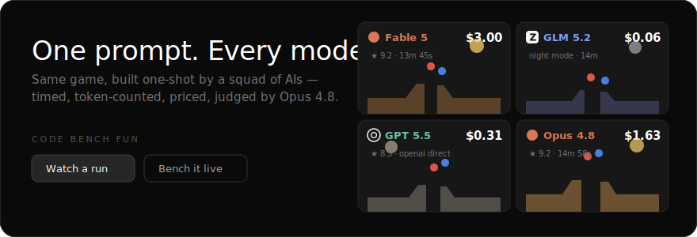

<div align="center">



# Code Bench Fun

**One prompt. Every model. One shot.**

Give the identical game prompt to a squad of AI models. Each gets exactly one completion — no retries, no iteration.
Wall-time, tokens, turns and dollars are counted while they build. **Opus 4.8 judges the results.**
The games ship to a gallery where the cost counters replay at each model's *true relative speed*.

[**Live site**](https://ggcryptoh.github.io/code_bench_fun/) · [Gallery](https://ggcryptoh.github.io/code_bench_fun/index.html) · [One-Shot Bench](https://ggcryptoh.github.io/code_bench_fun/bench.html) · [Usage](https://ggcryptoh.github.io/code_bench_fun/usage.html)

   

</div>

---

## Why this exists

Model launch posts show benchmarks. Nobody *feels* a benchmark.
But watch four models build the same physics toy side by side — one costs $3.00 and takes 14 minutes, one costs 6¢ and thinks itself to death, one nails it in 26 seconds for a penny — and you understand the frontier viscerally. That's the product: **benchmarks you can watch, priced in dollars, judged by a frontier model, formatted for a phone screen.**

## A real run

`cars-vs-canyon` — *"a red car and a blue car race up ramps and jump a canyon, physics, particles, loops forever"*:

| Model | Time | Out tokens | Cost | Judge | Verdict |
|---|---|---|---|---|---|
| **Fable 5** | 13m 45s | 58.0k | $3.00 | **★ 9.2** | "Complete, careful physics sim… meets every ask" |
| **Opus 4.8** | 14m 58s | 63.8k | $1.63 | **★ 9.2** | "Sound physics, rich desert art; both cars clear the gap" |
| GPT 5.5 | 2m 04s | 12.9k | $0.31 | ★ 8.5 | (via direct OpenAI API) |
| Grok 4.20 | 26s | 5.1k | $0.01 | ★ 5.3 | "Cars dive off-screen… then teleport" |
| Gemini 3.5 Flash | 36s | 7.8k | $0.07 | ★ 2 | "Fatal bug: cars never move; only bg animates" |
| GLM 5.2 | — | — | — | FAIL | thought for 32k tokens, wrote no HTML |

Every number above was measured live, and the failure rows stay in the gallery — one-shot means the misses count.

## What's in the box

- **Gallery** (`index.html`) — every run with live game covers, plus a per-model leaderboard: avg judge score, total spend, tokens/sec.
- **Run viewer** (`run.html?id=…`) — all builds playing *simultaneously*, each panel topped by a cost counter + timer that replays the generation race at true relative speed (8s default, `?replay=N` to tune). A **Rerun** menu generates the exact CLI command to redo the run with a different squad (`f` flips the roster, `r` picks a random one).
- **Reel mode** — one keystroke turns any run into a viewport-perfect square grid that loops the cost race every ~24s. Screen-record it vertically and it's Instagram/TikTok-ready. `Esc` exits.
- **One-Shot Bench** (`bench.html`) — the in-browser version: paste an OpenRouter key (stays in localStorage), describe a game once, watch every selected model stream in parallel, get judged results, download the bundle, import it to the gallery.
- **CLI runner** (`runner/bench.mjs`) — zero-dependency Node. Parallel builds, streaming timelines for authentic replay pacing, automatic single retry on truncated HTML, spend-limit auto-clamping, `--merge` to re-run individual models into an existing run.
- **TUI** (`runner/tui.mjs`) — a terminal cockpit: describe → pick models from a priced checklist → build → open → publish, plus a fix mode that preselects failed builds.

## Quickstart

```bash
git clone https://github.com/GGCryptoh/code_bench_fun && cd code_bench_fun

# the friendly way
node runner/tui.mjs

# the direct way
node runner/bench.mjs \
  --id lava-floor --title "The Floor Is Lava" --kind simulation \
  --models fable-5,glm-5.2,gpt-5.5,opus-4.8 \
  --prompt "A tiny village on stilts above rising lava; embers drift, villagers scurry, loops forever."

# watch it
python3 -m http.server 8619   # → http://127.0.0.1:8619/run.html?id=lava-floor

# ship it
git add -A && git commit -m "lava run" && git push
```

## Providers & keys

| Models | Route | Auth |
|---|---|---|
| Fable 5, Opus 4.8, Sonnet 5, Haiku 4.5 | local `claude` CLI | your Claude subscription — no key |
| GPT 5.5, GPT 5.1 | direct `api.openai.com` (falls back to OpenRouter) | `OPENAI_API_KEY` |
| GLM, Grok, Gemini, DeepSeek, Kimi, … | OpenRouter | `OPENROUTER_API_KEY` |

Keys resolve in order: **env var → `.env.local` at repo root → macOS keychain** (services `OPENROUTER_API_KEY` / `OPENAI_KEY`). `.env.local` is gitignored; on localhost the bench page auto-loads it so there's nothing to paste.

## The rules (what every model gets told)

One self-contained HTML file. No external requests of any kind. Must survive `sandbox="allow-scripts"` — no storage, no alerts. Fill the viewport, look good square. Simulations autoplay and loop forever. *"Push visual polish: it will be judged on looks in a screen recording."*

The judge scores **works / fidelity / polish / creativity** (0–10 each) from the source code alone, weighted 35/30/25/10. The full data contract lives in [`docs/SCHEMA.md`](docs/SCHEMA.md).

## Repo map

```
index.html  run.html  bench.html  usage.html  privacy.html   ← static site (no build step)
assets/site.{css,js}      design system + model registry + brand logos + counter engine
data/index.json           gallery index
data/runs/<id>.json       per-run stats, timelines, judge scores
games/<id>/<model>.html   the games themselves, exactly as generated
runner/bench.mjs          the benchmark engine        runner/tui.mjs   the cockpit
runner/import.mjs         imports browser-made run bundles
```

## ⚠ Costs

Benches spend real money. A frontier model writing a 60k-token game can cost **$1.50–3.00 per game**; budget models land under a dime. The estimate shown before every run is exactly that — an estimate.

## License

[MIT](LICENSE) © Geoff Hopkins. The generated games are AI output, kept verbatim — bugs, dead code, smuggled Google Fonts and all. That's the data.
